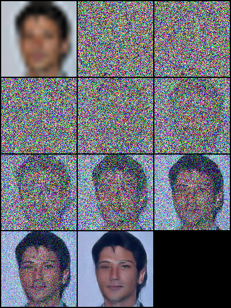
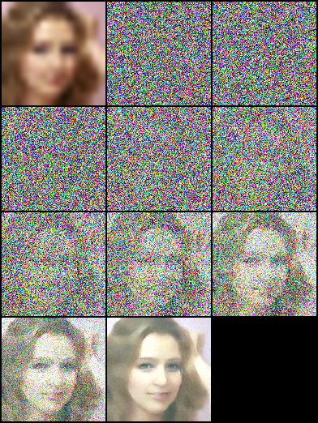
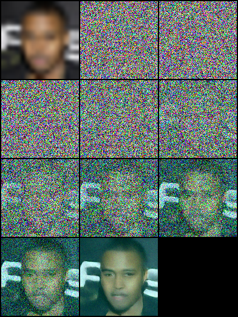

# Image Super-Resolution via Iterative Refinement

[Paper](https://arxiv.org/pdf/2104.07636.pdf ) |  [Project](https://iterative-refinement.github.io/ )

## Brief

Code Submission for UCLA CS245: Big Data Analytics course offered in Fall 2023

This is an unofficial implementation of **Image Super-Resolution via Iterative Refinement(SR3)** by **PyTorch**.

### Conditional Generation (with Super Resolution)

- [x] 16×16 -> 128×128 on FFHQ-CelebaHQ

### Steps to run the code:

1. `pip install -r requirement.txt`
2. Downlaod the [FFHQ](https://drive.google.com/drive/folders/1WocxvZ4GEZ1DI8dOz30aSj2zT6pkATYS) and 
    [CELEBHQ](https://www.kaggle.com/datasets/badasstechie/celebahq-resized-256x256) datasets
2. Create both the training and celebhq datasets in 16,128 formats: `python data/prepare_data.py  --path [dataset path]
--out [output path] --size 16,128` Edit the dataset path accordingly.
3. Two folders `ffhq_16_128` and `celebhq_16_12` will be created under `/dataset` directory.
4. For area upsampling download the pretrained model from [here](https://drive.google.com/drive/folders/1I4XGKkkU20C9dVLrP4cz-mOvB6hroTw7?usp=sharing)
5. Update the resume_state in `config/sr_sr3_16_128.json` to the path to these downloaded files. Example provided in the
json file
4. Train the model. The `config/sr_sr3_16_128.json` is already edited accordingly. Comment the resume state if you want
start from iteration 0
5. After training evaulate the model:
`python sr.py -p val -c config/sr_sr3_16_128.json` and run`python eval.py -p [result path]`Edit `result_path` 
to the location where the results were stores by previous command
    

## Results

Original SR3 metrics for 16×16 -> 128×128: SSIM=0.675, PSNR=23.26

| Tasks/Metrics                               | SSIM(+)       | PSNR(+) | 
|---------------------------------------------|---------------|---------| 
| 16×16 -> 128×128 (using area upsampling)    | 0.508         | 16.005  |
| 16×16 -> 128×128 (using bicubic upsampling) | Not available | 6.52    |
               
- #### 16×16 -> 128×128 on FFHQ-CelebaHQ with area upsampling

|  |      |      |
|----------------------------------------------------------------------------------------------------------------| ---- | ---- |

