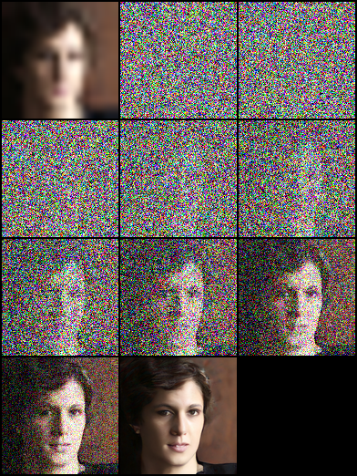

# Image Super-Resolution via Iterative Refinement

[Paper](https://arxiv.org/pdf/2104.07636.pdf ) |  [Project](https://iterative-refinement.github.io/ )

## Brief

Code Submission for UCLA CS245: Big Data Analytics course offered in Fall 2023

This is an unofficial implementation of **Image Super-Resolution via Iterative Refinement(SR3)** by **PyTorch**.
We experimented using bilinear interpolation instead of nearest interpolation with U-Net sampling.
### Conditional Generation (with Super Resolution)

- [x] 16×16 -> 128×128 on FFHQ-CelebaHQ

### Unconditional Generation

- [x] 128×128 face generation on FFHQ

### Training Step

- [x] log / logger
- [x] metrics evaluation
- [x] multi-gpu support
- [x] resume training / pretrained model
- [x] validate alone script
- [x] [Weights and Biases Logging](https://github.com/Janspiry/Image-Super-Resolution-via-Iterative-Refinement/pull/44) 🌟 NEW

### Datasets Used

- FFHQ : Training Datataset
- CelebaHQ : Testing Datatset

## Results

*Note:*  We set the maximum reverse steps budget to $2000$. We limited the model parameters in **image noise** and **hue deviation** occasionally appear in high-resolution images, resulting in low scores. We trained on 10,000 iterations. For achieveing higher effieciency than this, training the whole model is recommended. Replacing nearest neighbor upsampling in the U-Net decoder with area or bilinear interpolation yielded significantly better results in terms of both PSNR and SSIM scores.
Further analysis comparing different upsampling methods and their hyperparameters is necessary to determine the optimal choice for specific applications.


| Tasks/Metrics        | SSIM(+) | PSNR(+) | FID(-)  | IS(+)   |
| -------------------- |---------|---------| ---- | ---- |
| 16×16 -> 128×128 | 5.48    | 6.031   | - | - |

- #### 16×16 -> 128×128 on FFHQ-CelebaHQ

    

## Usage
### Environment
```python
pip install -r requirement.txt
```

### Training/Resume Training

```python
# Use sr.py and sample.py to train the super resolution task and unconditional generation task, respectively.
# Edit json files to adjust network structure and hyperparameters
python sr.py -p train -c config/sr_sr3_16_128.json
```

### Test/Evaluation

```python
# Edit json to add pretrain model path and run the evaluation 
python sr.py -p val -c config/sr_sr3_16_128.json

# Quantitative evaluation alone using SSIM/PSNR metrics on given result root
python eval.py -p [result root]
```

### Inference Alone

Set the  image path like steps in `Own Data`, then run the script:

```python
# run the script
python infer.py -c [config file]
```